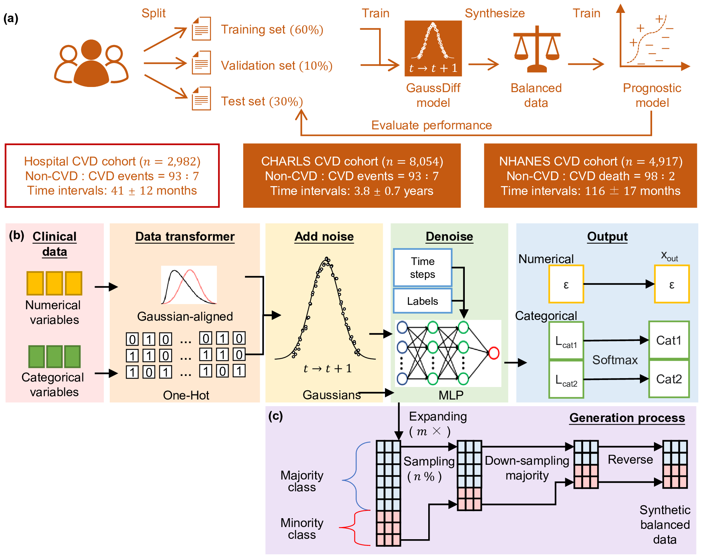

# GaussDiff: Gaussian-aligned diffusion for privacy-preserving class balancing in clinical prognoses

Official implementation of **GaussDiff: Gaussian-aligned diffusion for privacy-preserving class balancing in clinical prognoses**.

## Overview

GaussDiff introduces a **Gaussian alignment strategy** for diffusion-based synthetic data generation, specifically designed to address severe class imbalance in clinical prediction tasks. By aligning feature distributions to Gaussian space before diffusion modeling, GaussDiff achieves superior performance in recall, ROC-AUC, and survival analysis across multiple healthcare datasets.




## Installation

### Prerequisites
- Python 3.8+
- CUDA-compatible GPU (recommended)

### Install Dependencies
```bash
git clone https://github.com/enai4bio/GaussDiff.git
cd GaussDiff
pip install -r requirements.txt
```

## Quick Start

### CHARLS Example
```bash
cd CHARLS

# Full pipeline (train → sample → evaluate)
python run.py --job train_sample_eval --config configs/charls.toml
python run.py --wd <your_work_directory> --job train_sample_eval

# Or run stages individually:
python run.py --wd <your_work_directory> --job train --config configs/charls.toml
python run.py --wd <your_work_directory> --job sample --config configs/charls.toml
python run.py --wd <your_work_directory> --job eval --config configs/charls.toml
```

### NHANES Example
```bash
cd NHANES
python run.py --wd <your_work_directory> --job train_sample_eval --config configs/nhanes.toml
```

## Configuration

Edit `configs/*.toml` to customize your experiment:

```toml
[main]
work_dir = "."              # Working directory
device = "cuda:0"           # GPU device

[data.y]
label_column = "CVD"        # Target variable
num_classes = 2

[data.x]
numerical_feature_columns = ['Age', 'BMI', ...]
categorical_feature_columns = ['Gender', 'Diabetes', ...]

[train.main]
steps = 8000                # Training steps
init_lr = 0.00013           # Learning rate
seed = 0                    # Random seed
```

### Network Architecture Selection

| Dataset Size | Architecture | Recommendation |
|-------------|--------------|----------------|
| Large (n>5000) | [512,512,512,512,512,256] | 6-layer deep network |
| Small (n<2000) | [256,256,256] | 3-layer network to prevent overfitting |

### Core Hyperparameters

All experiments use consistent diffusion parameters:
- **n_timesteps**: 1000
- **scheduler**: cosine
- **normalization**: minmax
- **dropout**: 0.0
- **weight_decay**: 0.0

## Results

Performance on CHARLS CVD prediction (mean ± std, n=15 runs):

| Method | Recall | ROC-AUC | KM p-value |
|--------|--------|---------|------------|
| **GaussDiff** | **0.596±0.018** | **0.600±0.009** | **<0.001** |
| TVAE | 0.479±0.057 | 0.524±0.008 | 0.69 |
| CTGAN | 0.196±0.051 | 0.580±0.025 | <0.001 |
| ADASYN | 0.065±0.004 | 0.526±0.003 | 0.42 |
| SMOTE | 0.070±0.007 | 0.529±0.003 | 0.91 |
| Random oversampling | 0.000± 0.000 | 0.548±0.004 | --- |

**Key Achievement**: GaussDiff demonstrates the lowest variance among all methods, indicating superior stability and robustness.

Performance on NHANES CVD prediction (mean ± std, n=15 runs):

| Method | Recall | ROC-AUC | KM p-value |
|--------|--------|---------|------------|
| **GaussDiff** | **0.904±0.036** | **0.873±0.010** | **<0.001** |
| TVAE | 0.485±0.049 | 0.795±0.011 | <0.001 |
| CTGAN | 0.313±0.170 | 0.763±0.107 | <0.01 |
| ADASYN | 0.109±0.007 | 0.862±0.003 | <0.001 |
| SMOTE | 0.107±0.010 | 0.862±0.004 | <0.001 |
| Random oversampling | 0.000± 0.000 | **0.875±0.008** | --- |

## Evaluation Framework

GaussDiff evaluates synthetic data quality across three independent dimensions:

1. **Classification Performance**
   - Recall (minority class sensitivity)
   - ROC-AUC (ranking quality)
   - PR-AUC (precision-recall trade-off)

2. **Distribution Fidelity**
   - DCR (Distance to Closest Record)
   - Measures feature distribution similarity

3. **Temporal Risk Stratification**
   - Kaplan-Meier survival analysis
   - Log-rank test for group separation

These metrics assess different aspects independently: classification accuracy, feature distribution quality, and temporal progression prediction.

## Project Structure

```
GaussDiff/
├── CHARLS/                  # CHARLS dataset pipeline
│   ├── configs/
│   │   └── charls.toml
│   ├── data/
│   │   ├── 1_origin/        # Raw data
│   │   ├── 2_split/         # Train/val/test splits
│   │   └── 3_boxcox/        # Preprocessed data
│   ├── src/charls_pipeline/
│   │   ├── train.py         # Training module
│   │   ├── sample.py        # Sampling module
│   │   ├── eval.py          # Evaluation module
│   │   └── models/          # Model implementations
│   └── run.py
├── NHANES/                  # NHANES dataset pipeline
├── LICENSE
├── README.md
└── requirements.txt
```

## Methodology

### Gaussian Alignment for Diffusion

Traditional diffusion models assume Gaussian noise schedules, which may not optimally handle non-Gaussian feature distributions common in clinical data. GaussDiff introduces a **Gaussian alignment preprocessing step** that transforms features into a space more amenable to diffusion modeling, leading to:

1. **Improved convergence** during training
2. **Better feature preservation** in synthetic samples  
3. **Enhanced minority class representation**

This alignment is performed adaptively per feature based on its statistical properties, ensuring optimal transformation for each variable.

### Class-Balanced Sampling Strategy

GaussDiff employs a two-stage sampling approach:
1. Generate oversampled candidates
2. Select balanced subsets maintaining target class distribution

This ensures synthetic datasets address the original class imbalance while preserving feature relationships.

## Citation

If you use this code, please cite:

```bibtex
@article{gaussdiff2025,
  title={GaussDiff: Gaussian-aligned Diffusion Balancer for Synthetic Data Generation in Imbalanced Healthcare Datasets},
  author={, et al.},
  journal={Journal Name},
  year={2025}
}
```

## Acknowledgments

This project builds upon the diffusion modeling framework from [TabDDPM](https://github.com/yandex-research/tab-ddpm) (Kotelnikov et al., 2023):

```bibtex
@inproceedings{kotelnikov2023tabddpm,
  title={TabDDPM: Modelling Tabular Data with Diffusion Models},
  author={Kotelnikov, Akim and Baranchuk, Dmitry and Rubachev, Ivan and Babenko, Artem},
  booktitle={ICML},
  year={2023}
}
```

**Data Sources**:
- [CHARLS](http://charls.pku.edu.cn/): China Health and Retirement Longitudinal Study
- [NHANES](https://www.cdc.gov/nchs/nhanes/): National Health and Nutrition Examination Survey

## License

This project is licensed under the MIT License - see [LICENSE](LICENSE) for details.

Portions of the diffusion modeling code are derived from TabDDPM, licensed under Apache License 2.0.

## Contact

For questions or issues:
- Open an issue on GitHub
- Email: stzhangjie@hotmail.com, lilypjm@hotmail.com

## Contributing

Contributions are welcome! Please feel free to submit a Pull Request.
